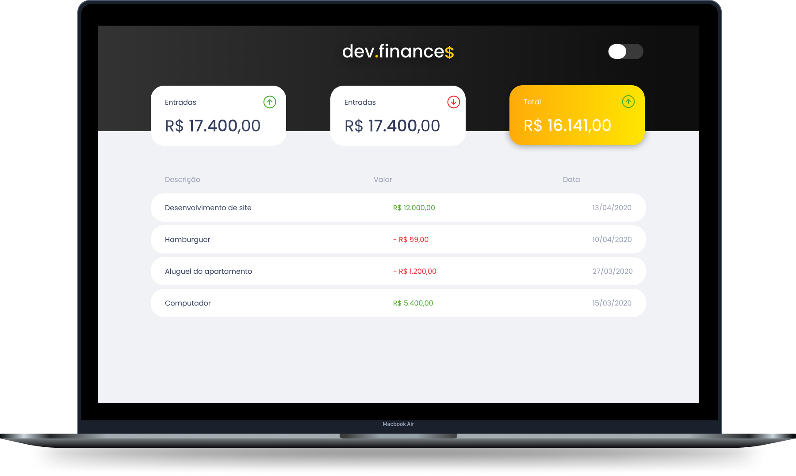
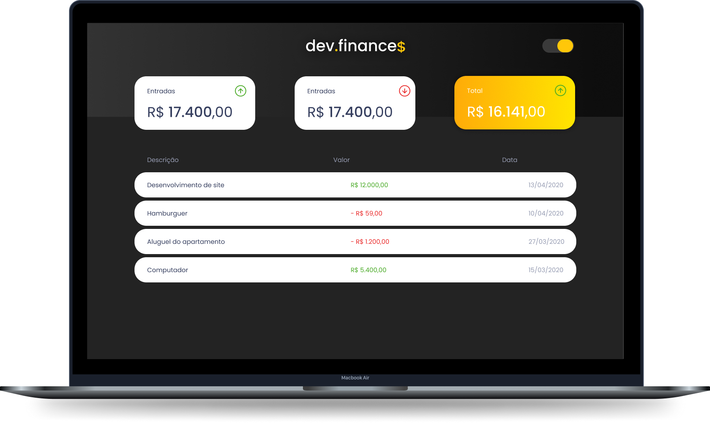

<h1 align="center">
  
</h1>

  <a href="#-tecnologias">Techs</a>&nbsp;&nbsp;&nbsp;|&nbsp;&nbsp;&nbsp;
  <a href="#-projeto">Project</a>&nbsp;&nbsp;&nbsp;|&nbsp;&nbsp;&nbsp;
  <a href="#-layout">Layout</a>&nbsp;&nbsp;&nbsp;|&nbsp;&nbsp;&nbsp;
  <a href="#memo-licença">Licence</a>

 

  

 

Initial Page
  

Dashboard Light Mode
  

Dashboard Dark Mode
  

## 🚀 Techs

This project was developed with the following technologies:

- HTML
- CSS
- JavaScript

## ✨ Inspiration

This project was based on Discover Marathon of [Rocketseat](https://www.youtube.com/rocketseat).

## 👨🏼‍💻 Increments

- Color pallete

- Dark mode
  
- Initial page

## 💻 Project

dev.finances is a financial control application, where you can register and delete transactions and see the incoming and outgoing balance. 💰

## 🔖 Layout

You can view the original layout of the project through [this link](https://www.figma.com/file/7Vu9DzUaCZIV4nibzkjgB4/dev.finance%24-Maratona-Discover). You must have a [Figma](https://figma.com) account to access it.

## 📝 Licence

This project is under the MIT license. See the archive [LICENSE](LICENSE.md) for more details. 

---

By [Kauê Mendes](https://www.github.com/kauemends)